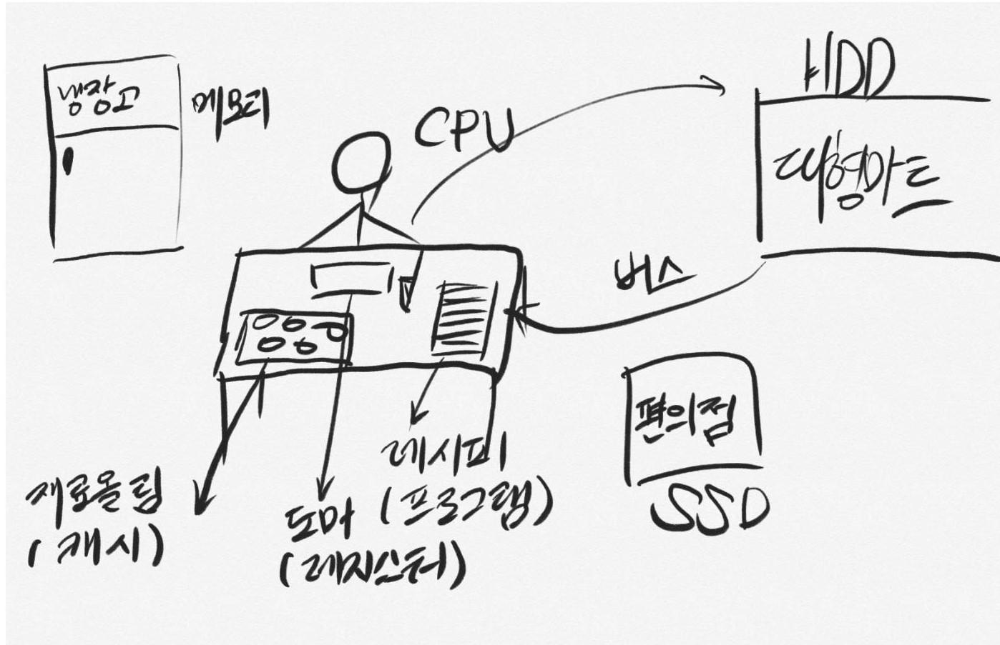

## 디지털

* 0과 1로만 계산 -> 상태가 2가지 뿐이라 오류시 복구가 쉬움 ex) 0.5라는 수가 나오면 1로 인식 , 봉화

* 인류가 10진수를 쓰는건 손가락이 10개라서...?

* 왜 디지털이 나오게 된건가? 무엇이 불편했기에..

------------------------------------------------------

## 컴퓨터 구조

1. CPU (Central Proccessing Unit 중앙처리장치)

* 컴퓨터의 모든 계산은 CPU에서 이루어짐

* RAM에 올라간 프로그램들을 CPU에서 연산

2. RAM (주기억장치)

* 컴퓨터가 꺼지면 내용이 지워지는 휘발성 기억장치

* 보조기억장치보다 빠르기 때문에 훨씬 비쌈

* 보조기억장치에서 불러온 프로그램이 올라가는 공간

3. HDD / SSD (보조기억장치)

* 전원이 꺼져도 자료들이 영구히 보존됨. 따라서 운영체제도 이 곳에 저장됨.

* 용량이 크지만 속도가 느림

* HDD는 축음기처럼 플래터의 표면을 직접 읽으면서 데이터를 기록하기에 느림.

* SSD는 반도체로 동작하기에 HDD에서처럼 기계적 구동장치가 필요없음. 훨씬 빠름. 하드웨어 기술이 발전하면서 SSD의 단점이 많이 커버됨.

4. 그래픽카드(Graphics Processing Unit)

* 연산이 많이 필요한 3D 그래픽을 처리하기 위해 개발됨

* 단순계산이 빠름 (병렬일괄처리 <-> CPU는 순차처리), ALU의 개수가 많음 

5. 메인보드(마더보드)

* 각종 주변기기들을 서로 연결해주는 통로역할

* 각 부품의 규격을 정해줌

6. 파워

* 컴퓨터에 전기를 공급

### 요리로 비유

