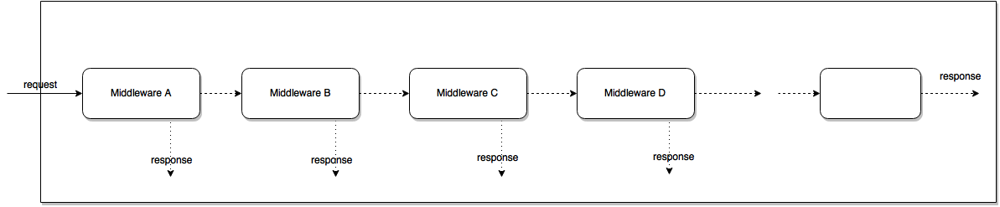

# Express

Express 는 가장 인기있는 Node 웹 프레임 워크 이며, 다른 많은 인기있는 Node web frameworks의 기본 라이브러리 입니다. Express는 다음과 같은 메커니즘을 제공합니다:

- HTTP 통신 요청(Request; GET, POST, DELETE 등)에 대한 핸들러를 만든다.
- 템플릿에 데이터를 넣어 응답(response)을 만들기 위해 view의 렌더링 엔진과 결합(integrate)한다. 
- 접속을 위한 포트나 응답 렌더링을 위한 템플릿 위치같은 공통 웹 어플리케이션 세팅을 한다. 
- 핸들링 파이프라인(reqest handling pipeline) 중 필요한 곳에 추가적인 미들웨어 처리 요청을 추가한다. -> 가볍고 유연함


## 미들웨어란?
- 서버는 요청에서부터 응답까지 하나의 흐름을 가지고 있습니다. 이 요청과 응답 사이에 실행되는 함수 목록을 우리는 “미들웨어 함수”라고 하겠습니다.
- 미들웨어 함수는 본연의 역할을 한 뒤 두 가지 일을 할 수 있습니다. ▲ 요청한 클라이언트에게 응답 하거나 ▲ 다음 미들웨어 함수를 호출하는 것이죠. 후자일 경우 현재 미들웨어 함수의 결과 값을 다음 미들웨어 함수의 인자로 전달하는 구조입니다.

머릿속 이미지와 아래 그림이 같다면 제대로 이해하신 겁니다.



# Express 구조
[Express 설치](http://webframeworks.kr/getstarted/expressjs/)
```
/myapp
  ⌊ /bin
      ⌊ www
  ⌊ /public
      ⌊ /images
      ⌊ /javascripts
      ⌊ /stylesheets
  ⌊ /routes
      ⌊ index.js
      ⌊ users.js
  ⌊ /views
      ⌊ index.jade
  ⌊ app.js
  ⌊ package.json
```


# Express 정적파일 보내기

```
server.use(express.static('public'));

server.use((req, res, next) => {
    next();
})
```
nodemon server로 서버 실행하기
